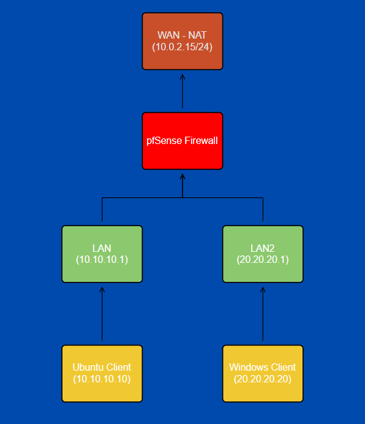

<a name="readme-top"></a>

<br/>
<div align="center">
  <a>
    
  </a>
  <h3 align="center">How to Configure pfSense and Useful Features</h3>

  <p align="center">
    A Simple Network Project 
    <br />
    <br />
    ·
    <a href="https://github.com/ylScarred/pfSense-Firewall-Setup/issues">Report Bug</a>
    ·
    <a href="https://github.com/ylScarred/pfSense-Firewall-Setup/issues">Request Feature</a>
  </p>
</div>


<details>
  <summary>Table of Contents</summary>
  <ol>
    <li>
      <a href="#about-the-project">About The Project</a>
      <ul>
        <li><a href="#built-with">Built With</a></li>
      </ul>
    </li>
    <li>
      <a href="#getting-started">Getting Started</a>
      <ul>
        <li><a href="#installation">Installation</a></li>
      </ul>
    </li>
    <li>
      <a href="#terminology">Terminology</a>
      <ul>
              <li><a href="#network">Network</a></li>
              <li><a href="#lan-and-wan">Lan and WAN</a></li>
              <li><a href="#dns">DNS</a></li>
              <li><a href="#http">HTTP</a></li>
              <li><a href="#static-ip">Static IP</a></li>
              <li><a href="#broadcasting">Broadcasting</a></li>
              <li><a href="#mac">MAC</a></li>
              <li><a href="#dhcp">DHCP</a></li>        
              <li><a href="#router">Router</a></li>
              <li><a href="#switch">Switch</a></li>
              <li><a href="#gateway">Gateway</a></li>  
              <li><a href="#arp">ARP</a></li>    
              <li><a href="#tcp-handshake">TCP Handshake</a></li>    
      </ul>
    </li>
    <li>
      <a href="#setting-up">Setting Up</a>
    </li>
    <li><a href="#references">License</a></li>
    <li><a href="#contact">Contact</a></li>
    <li><a href="#license">Acknowledgments</a></li>
  </ol>
</details>


## About The Project

<div align="center">
    <a>
      
    </a>
</div>


In the rapidly evolving landscape of networking, having a robust and secure network infrastructure is crucial. This project aims to guide you through the process of configuring pfSense, an open-source firewall and routing software, to create a secure and efficient network environment. Whether you are setting up a home network or a small business network, pfSense provides a flexible and powerful solution for managing traffic, enhancing security, and optimizing performance.

<p align="right">(<a href="#readme-top">back to top</a>)</p>


### Built With

This project was built using the following components:

* [![ubuntu][ubuntu]][ubuntu-url]
* [![windows][windows]][windows-url]
* [![linux][linux]][linux-url]
* [![pfsense][pfsense]][pfsense-url]
* [![virtualbox][virtualbox]][virtualbox-url]

[ubuntu]: https://img.shields.io/badge/Ubuntu-E95420?style=for-the-badge&logo=ubuntu&logoColor=white
[ubuntu-url]: https://ubuntu.com/
[windows]: https://img.shields.io/badge/Windows-0078D6?style=for-the-badge&logo=windows&logoColor=white
[windows-url]: https://www.microsoft.com
[linux]: https://img.shields.io/badge/Linux-FCC624?style=for-the-badge&logo=linux&logoColor=black
[linux-url]: https://www.linux.org/
[pfsense]: https://img.shields.io/badge/PFSense-000000?style=for-the-badge&logo=pfsense&logoColor=white
[pfsense-url]: https://www.pfsense.org/
[virtualbox]: https://img.shields.io/badge/VirtualBox-00000?style=for-the-badge&logo=virtualbox&logoColor=white&color=blue
[virtualbox-url]: https://www.virtualbox.org/

<p align="right">(<a href="#readme-top">back to top</a>)</p>


## Getting Started

This project includes configuration of both Windows and Ubuntu clients' LANs. Firstly we configure our pfSense's network settings for having a WAN, LAN and LAN2. We will assign LAN IP address from pfSense itself to 10.10.10.1 for reaching the web interface from our Ubuntu client, for LAN2 we will assign 20.20.20.1 IP address for Windows client. Then we use firewall's web interface on Ubuntu client to assign a static IP of 10.10.10.10 to our client. Windows client will also get a static IP of 20.20.20.20 assigned.


 
### Installation

1. Download VirtualBox
   ```sh
   https://www.virtualbox.org/wiki/Downloads
   ```
2. Download Ubuntu for VirtualBox
   ```sh
   https://ubuntu.com/download/desktop
   ```
3. Download Windows10 for VirtualBox

   _Windows10 image is not provided anymore by Microsoft, you can download it from the link below. It also has a password set as "Passw0rd!"_
   ```sh
   https://drive.google.com/file/d/1YKnn1bzbC_34oEX91Vxj5BB1GdmWW3tP
   ```


4. Download PFSense for VirtualBox
   ```sh
    https://www.pfsense.org/download/
   ```
   
5. Configure the RAM and GPU for the virtual machines.
   <br />
   <br />
   
   That's it, we're now ready to start setting up our pfSense Firewall.

  _Note: For Windows, you must give at least 2 GB of RAM for it to work properly._

<p align="right">(<a href="#readme-top">back to top</a>)</p>


## Terminology

Before we begin the configuration of our firewall, we need to understand some terms.

### Network

A network consists of two or more computers that are linked in order to share resources (such as printers and CDs), exchange files, or allow electronic communications. The computers on a network may be linked through cables, telephone lines, radio waves, satellites, or infrared light beams.

### LAN and WAN

A local area network (LAN) is a collection of devices connected together in one physical location, such as a building, office, or home. A LAN can be small or large, ranging from a home network with one user to an enterprise network with thousands of users and devices in an office or school.

A wide-area network (WAN) is the technology that connects your offices, data centers, cloud applications, and cloud storage together. It is called a wide-area network because it spans beyond a single building or large campus to include multiple locations spread across a specific geographic area, or even the world. For example, businesses with many international branch offices use a WAN to connect office networks together. The world’s largest WAN is the internet because it is a collection of many international networks that connect to each other. This article focuses on enterprise WANs and their uses and benefits.

### Subnet

A subnet is the division of a larger network into smaller logical networks. It enables better organization and management of IP addresses by grouping devices based on network requirements, security policies, or other factors.

Without proper routing between subnets, devices on one subnet cannot communicate directly with devices on the other subnet.

In our project 10.10.10.0/24 , 20.20.20.0/24 are the subnets of our LANs.

### DNS

DNS, or the Domain Name System, translates human readable domain names to machine readable IP addresses. The Internet’s DNS system works much like a phone book by managing the mapping between names and numbers. DNS servers translate requests for names into IP addresses, controlling which server an end user will reach when they type a domain name into their web browser.

### HTTP

### Static IP

### Broadcasting

### MAC

### DHCP

### Router

### Switch

### Gateway

### ARP

### TCP Handshake

<p align="right">(<a href="#readme-top">back to top</a>)</p>


## Setting Up

<p align="right">(<a href="#readme-top">back to top</a>)</p>


## References

These are the references I used for research and configure my Firewall.

* [Network](https://fcit.usf.edu/network/chap1/chap1.htm#WideAreaNetwork)
* [LAN](https://www.cisco.com/c/en/us/products/switches/what-is-a-lan-local-area-network.html)
* [WAN](https://aws.amazon.com/what-is/wan/)
* [Subnet]()
* [DNS]()
* [HTTP]()
* [Static IP]()
* [Broadcasting]()
* [MAC]()
* [DHCP]()
* [Router]()
* [Switch]()
* [Getaway]()
* [ARP]()
* [TCP]()


## Contact

Ömer Faruk YILDIRIM - [LinkedIn](https://www.linkedin.com/in/%C3%B6mer-faruk-y%C4%B1ld%C4%B1r%C4%B1m-004292241/) - omeryildirim0640@gmail.com

Project Link: [https://github.com/ylScarred/pfSense-Firewall-Setup/](https://github.com/ylScarred/pfSense-Firewall-Setup/)


## License

Distributed under the MIT License. See `LICENSE.txt` for more information.

<p align="right">(<a href="#readme-top">back to top</a>)</p>
