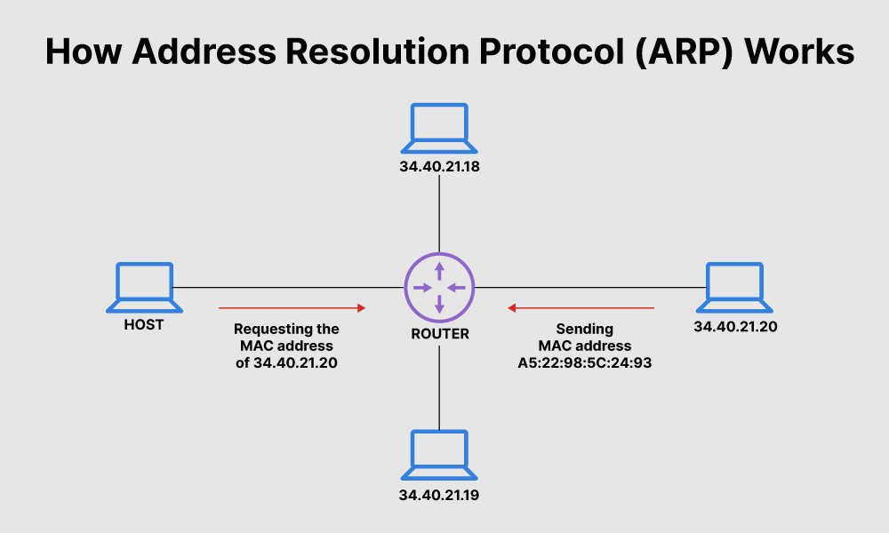

<a name="readme-top"></a>

<br/>
<div align="center">
  <a>
    
  </a>
  <h3 align="center">How to Configure pfSense and Useful Features</h3>

  <p align="center">
    A Simple Network Project 
    <br />
    <br />
    ·
    <a href="https://github.com/ylScarred/pfSense-Firewall-Setup/issues">Report Bug</a>
    ·
    <a href="https://github.com/ylScarred/pfSense-Firewall-Setup/issues">Request Feature</a>
  </p>
</div>


<details>
  <summary>Table of Contents</summary>
  <ol>
    <li>
      <a href="#about-the-project">About The Project</a>
      <ul>
        <li><a href="#built-with">Built With</a></li>
      </ul>
    </li>
    <li>
      <a href="#getting-started">Getting Started</a>
      <ul>
        <li><a href="#installation">Installation</a></li>
      </ul>
    </li>
    <li>
      <a href="#terminology">Terminology</a>
      <ul>
              <li><a href="#network">Network</a></li>
              <li><a href="#lan-and-wan">LAN and WAN</a></li>
              <li><a href="#osi">OSI</a></li>
              <li><a href="#tcpip">TCP/IP</a></li>
              <li><a href="#tcp-handshake">TCP Handshake</a></li>
              <li><a href="#subnet">Subnet</a></li>    
              <li><a href="#dns">DNS</a></li>
              <li><a href="#http">HTTP</a></li>
              <li><a href="#mac">MAC</a></li>
              <li><a href="#dhcp">DHCP</a></li>        
              <li><a href="#router">Router</a></li>
              <li><a href="#switch">Switch</a></li>
              <li><a href="#gateway">Gateway</a></li>  
              <li><a href="#arp">ARP</a></li>    

      </ul>
    </li>
    <li>
      <a href="#setting-up">Setting Up</a>
    </li>
    <li><a href="#references">License</a></li>
    <li><a href="#contact">Contact</a></li>
    <li><a href="#license">Acknowledgments</a></li>
  </ol>
</details>


## About The Project

<div align="center">
    <a>
      
    </a>
</div>


In the rapidly evolving landscape of networking, having a robust and secure network infrastructure is crucial. This project aims to guide you through the process of configuring pfSense, an open-source firewall and routing software, to create a secure and efficient network environment. Whether you are setting up a home network or a small business network, pfSense provides a flexible and powerful solution for managing traffic, enhancing security, and optimizing performance.

<p align="right">(<a href="#readme-top">back to top</a>)</p>


### Built With

This project was built using the following components:

* [![ubuntu][ubuntu]][ubuntu-url]
* [![windows][windows]][windows-url]
* [![linux][linux]][linux-url]
* [![pfsense][pfsense]][pfsense-url]
* [![virtualbox][virtualbox]][virtualbox-url]

[ubuntu]: https://img.shields.io/badge/Ubuntu-E95420?style=for-the-badge&logo=ubuntu&logoColor=white
[ubuntu-url]: https://ubuntu.com/
[windows]: https://img.shields.io/badge/Windows-0078D6?style=for-the-badge&logo=windows&logoColor=white
[windows-url]: https://www.microsoft.com
[linux]: https://img.shields.io/badge/Linux-FCC624?style=for-the-badge&logo=linux&logoColor=black
[linux-url]: https://www.linux.org/
[pfsense]: https://img.shields.io/badge/PFSense-000000?style=for-the-badge&logo=pfsense&logoColor=white
[pfsense-url]: https://www.pfsense.org/
[virtualbox]: https://img.shields.io/badge/VirtualBox-00000?style=for-the-badge&logo=virtualbox&logoColor=white&color=blue
[virtualbox-url]: https://www.virtualbox.org/

<p align="right">(<a href="#readme-top">back to top</a>)</p>


## Getting Started

This project includes configuration of both Windows and Ubuntu clients' LANs. Firstly we configure our pfSense's network settings for having a WAN, LAN and LAN2. We will assign LAN IP address from pfSense itself to 10.10.10.1 for reaching the web interface from our Ubuntu client, for LAN2 we will assign 20.20.20.1 IP address for Windows client. Then we use firewall's web interface on Ubuntu client to assign a static IP of 10.10.10.10 to our client. Windows client will also get a static IP of 20.20.20.20 assigned.


 
### Installation

1. Download VirtualBox
   ```sh
   https://www.virtualbox.org/wiki/Downloads
   ```
2. Download Ubuntu for VirtualBox
   ```sh
   https://ubuntu.com/download/desktop
   ```
3. Download Windows10 for VirtualBox

   _Windows10 image is not provided anymore by Microsoft, you can download it from the link below. It also has a password set as "Passw0rd!"_
   ```sh
   https://drive.google.com/file/d/1YKnn1bzbC_34oEX91Vxj5BB1GdmWW3tP
   ```


4. Download PFSense for VirtualBox
   ```sh
    https://www.pfsense.org/download/
   ```
   
5. Configure the RAM and GPU for the virtual machines.
   <br />
   <br />
   
   That's it, we're now ready to start setting up our pfSense Firewall.

  _Note: For Windows, you must give at least 2 GB of RAM for it to work properly._

<p align="right">(<a href="#readme-top">back to top</a>)</p>


## Terminology

Before we begin the configuration of our firewall, we need to understand some terms.

### Network

A network consists of two or more computers that are linked in order to share resources (such as printers and CDs), exchange files, or allow electronic communications. The computers on a network may be linked through cables, telephone lines, radio waves, satellites, or infrared light beams.

### LAN and WAN

A local area network (LAN) is a collection of devices connected together in one physical location, such as a building, office, or home. A LAN can be small or large, ranging from a home network with one user to an enterprise network with thousands of users and devices in an office or school.

A wide-area network (WAN) is the technology that connects your offices, data centers, cloud applications, and cloud storage together. It is called a wide-area network because it spans beyond a single building or large campus to include multiple locations spread across a specific geographic area, or even the world. For example, businesses with many international branch offices use a WAN to connect office networks together. The world’s largest WAN is the internet because it is a collection of many international networks that connect to each other. This article focuses on enterprise WANs and their uses and benefits.

### OSI

The Open Systems Interconnection (OSI) model describes seven layers that computer systems use to communicate over a network. It was the first standard model for network communications, adopted by all major computer and telecommunication companies in the early 1980s.

<a>
    
</a>

### TCP/IP

The modern Internet is not based on OSI, but on the simpler TCP/IP model. The transmission control protocol (TCP) is the internet standard ensuring the successful exchange of data packets between devices over a network. TCP is the underlying communication protocol for a wide variety of applications, including web servers and websites, email applications, FTP and peer-to-peer apps.

TCP operates with the internet protocol (IP) to specify how data is exchanged online. IP is responsible for sending each packet to its destination, while TCP guarantees that bytes are transmitted in the order in which they were sent with no errors or omissions. Together, the two protocols are referred to as TCP/IP.

### TCP Handshake

Establishing a TCP connection requires that both the client and server participate in what is known as a three-way handshake. The process can be broken down as follows:

<a>
    
</a>

A client sends the server a SYN packet—a connection request from its source port to a server’s destination port.
The server responds with a SYN/ACK packet, acknowledging the receipt of the connection request.
The client receives the SYN/ACK packet and responds with an ACK packet of its own.
After the connection is established, TCP works by breaking down transmitted data into segments, each of which is packaged into a datagram and sent to its destination.

### Subnet

A subnet is the division of a larger network into smaller logical networks. It enables better organization and management of IP addresses by grouping devices based on network requirements, security policies, or other factors.

Without proper routing between subnets, devices on one subnet cannot communicate directly with devices on the other subnet.

In our project 10.10.10.0/24 , 20.20.20.0/24 are the subnets of our LANs.

### DNS

DNS, or the Domain Name System, translates human readable domain names to machine readable IP addresses. The Internet’s DNS system works much like a phone book by managing the mapping between names and numbers. DNS servers translate requests for names into IP addresses, controlling which server an end user will reach when they type a domain name into their web browser.

### HTTP

The Hypertext Transfer Protocol (HTTP) is the foundation of the World Wide Web, and is used to load webpages using hypertext links. HTTP is an application layer protocol designed to transfer information between networked devices and runs on top of other layers of the network protocol stack. A typical flow over HTTP involves a client machine making a request to a server, which then sends a response message.

### MAC

A MAC address (Media Access Control Address) is a 12-digit hexadecimal number assigned to each device connected to the network. Primarily specified as a unique identifier during device manufacturing, the MAC address is often found on a device's network interface card. A MAC address is required when trying to locate a device or when performing diagnostics on a network device.

The MAC address belongs to the data link layer of the Open Systems Interconnection (OSI) model, which encapsulates the MAC address of the source and destination in the header of each data frame to ensure node-to-node communication.

### DHCP

Dynamic Host Configuration Protocol (DHCP) is a client/server protocol that automatically provides an Internet Protocol (IP) host with its IP address and other related configuration information such as the subnet mask and default gateway.

Every device on a TCP/IP-based network must have a unique unicast IP address to access the network and its resources. Without DHCP, IP addresses for new computers or computers that are moved from one subnet to another must be configured manually; IP addresses for computers that are removed from the network must be manually reclaimed.

<a>
    
</a>

With DHCP, this entire process is automated and managed centrally. The DHCP server maintains a pool of IP addresses and leases an address to any DHCP-enabled client when it starts up on the network. Because the IP addresses are dynamic (leased) rather than static (permanently assigned), addresses no longer in use are automatically returned to the pool for reallocation.

### Switch

A network switch is a physical device that operates at the Data Link Layer, Layer 2 of the Open Systems Interconnect (OSI) model. It receives packets sent by devices connected to physical ports and forwards them to devices. intended to reach the packets. Switches can also operate at the Network Layer (Layer 3) where routing occurs.

### Router

A router is a device that connects two or more packet switched networks or subnets. Layer 3 switch's can also act as routers.

One of the primary jobs of a router is to assign IP addresses to the computers on a home network. The router has a pool of IP addresses that it keeps track of. When a computer connects to it and asks for an IP address, the router picks an IP address from the pool and assigns it to the computer. The router makes sure that two computers are not assigned the same IP address. This process of computers asking for an IP address from the router is called dynamic IP address assignment. It uses the network protocol called DHCP.

<a>
    
</a>

### Gateway

A default gateway is a node in a computer network that enables connection to other networks. It allows devices on separate networks to communicate with one another.
It serves as a forwarding host when no other routes for the destination Internet Protocol (IP) address have been specified. It can also act as an intermediary between multiple devices connected to a shared subnet.
A default gateway in action can be found when accessing web pages. Each request is sent through the gateway before it actually gets onto the internet, and vice versa.

### ARP

Address Resolution Protocol (ARP) is a protocol or procedure that connects an ever-changing Internet Protocol (IP) address to a fixed physical machine address, also known as a media access control (MAC) address, in a local-area network (LAN). 

When a new computer joins a local area network (LAN), it will receive a unique IP address to use for identification and communication. 

Packets of data arrive at a gateway, destined for a particular host machine. The gateway, or the piece of hardware on a network that allows data to flow from one network to another, asks the ARP program to find a MAC address that matches the IP address. The ARP cache keeps a list of each IP address and its matching MAC address. The ARP cache is dynamic, but users on a network can also configure a static ARP table containing IP addresses and MAC addresses.

ARP caches are kept on all operating systems in an IPv4 Ethernet network. Every time a device requests a MAC address to send data to another device connected to the LAN, the device verifies its ARP cache to see if the IP-to-MAC-address connection has already been completed. If it exists, then a new request is unnecessary. However, if the translation has not yet been carried out, then the request for network addresses is sent, and ARP is performed.

An ARP cache size is limited by design, and addresses tend to stay in the cache for only a few minutes. It is purged regularly to free up space. This design is also intended for privacy and security to prevent IP addresses from being stolen or spoofed by cyberattackers. While MAC addresses are fixed, IP addresses are constantly updated.

In the purging process, unutilized addresses are deleted; so is any data related to unsuccessful attempts to communicate with computers not connected to the network or that are not even powered on.

<a>
    
</a>

<p align="right">(<a href="#readme-top">back to top</a>)</p>


## Setting Up

<p align="right">(<a href="#readme-top">back to top</a>)</p>


## References

These are the references I used for research and configure my Firewall.

* [Network](https://fcit.usf.edu/network/chap1/chap1.htm#WideAreaNetwork)
* [LAN](https://www.cisco.com/c/en/us/products/switches/what-is-a-lan-local-area-network.html)
* [WAN](https://aws.amazon.com/what-is/wan/)
* [OSI](https://www.imperva.com/learn/application-security/osi-model/)
* [TCP/IP & TCP Handshake](https://www.imperva.com/learn/ddos/tcp-transmission-control-protocol/)
* [Subnet](https://www.techtarget.com/searchnetworking/definition/subnet)
* [DNS](https://aws.amazon.com/route53/what-is-dns/)
* [HTTP](https://www.cloudflare.com/learning/ddos/glossary/hypertext-transfer-protocol-http/)
* [MAC](https://www.techtarget.com/searchnetworking/definition/MAC-address)
* [DHCP](https://learn.microsoft.com/en-us/windows-server/networking/technologies/dhcp/dhcp-top)
* [Router](https://www.cloudflare.com/learning/network-layer/what-is-a-router)
* [Switch](https://www.lifewire.com/difference-between-router-and-switch-5207135)
* [Default Getaway](https://www.itpro.com/network-internet/30327/what-is-a-default-gateway)
* [ARP]()
* [Snort](https://dogukankurnaz.medium.com/pfsense-snort-kurulumu-af72346b31fb)


## Contact

Ömer Faruk YILDIRIM - [LinkedIn](https://www.linkedin.com/in/%C3%B6mer-faruk-y%C4%B1ld%C4%B1r%C4%B1m-004292241/) - omeryildirim0640@gmail.com

Project Link: [https://github.com/ylScarred/pfSense-Firewall-Setup/](https://github.com/ylScarred/pfSense-Firewall-Setup/)


## License

Distributed under the MIT License. See `LICENSE.txt` for more information.

<p align="right">(<a href="#readme-top">back to top</a>)</p>
